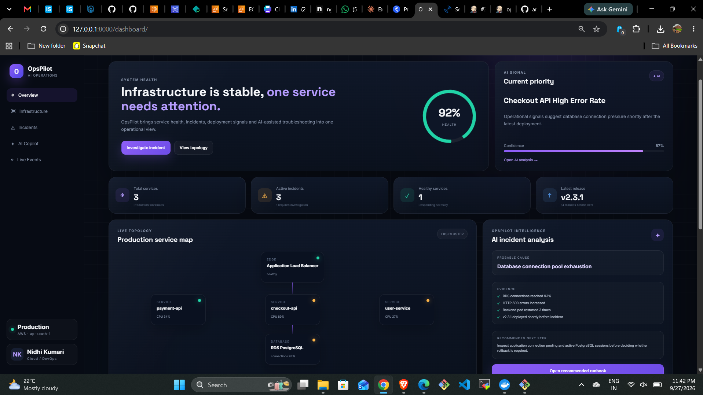
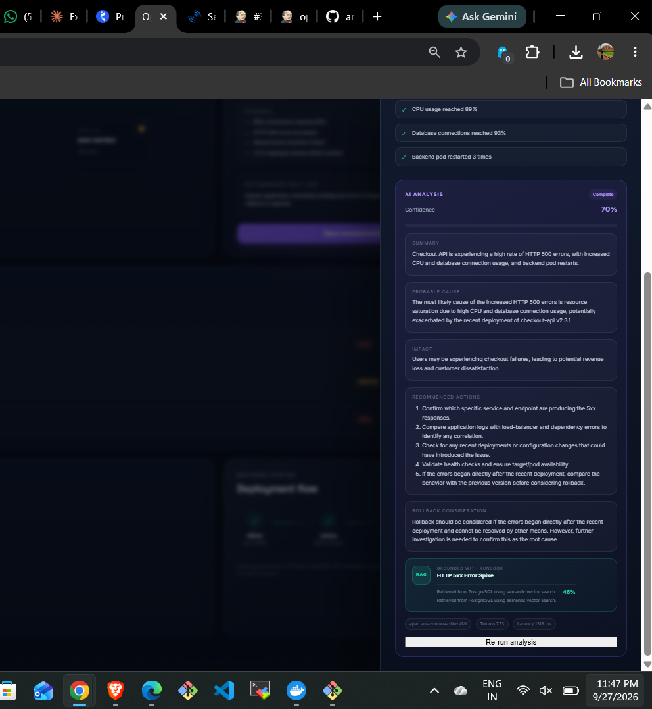
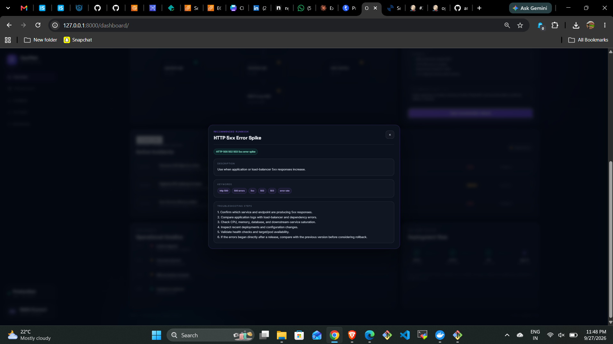
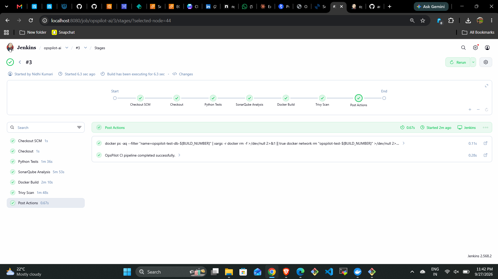
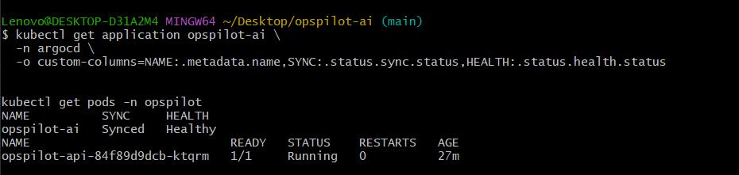
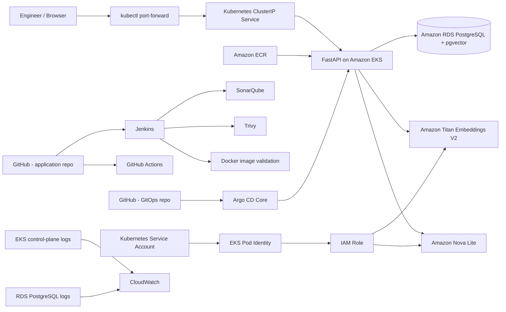
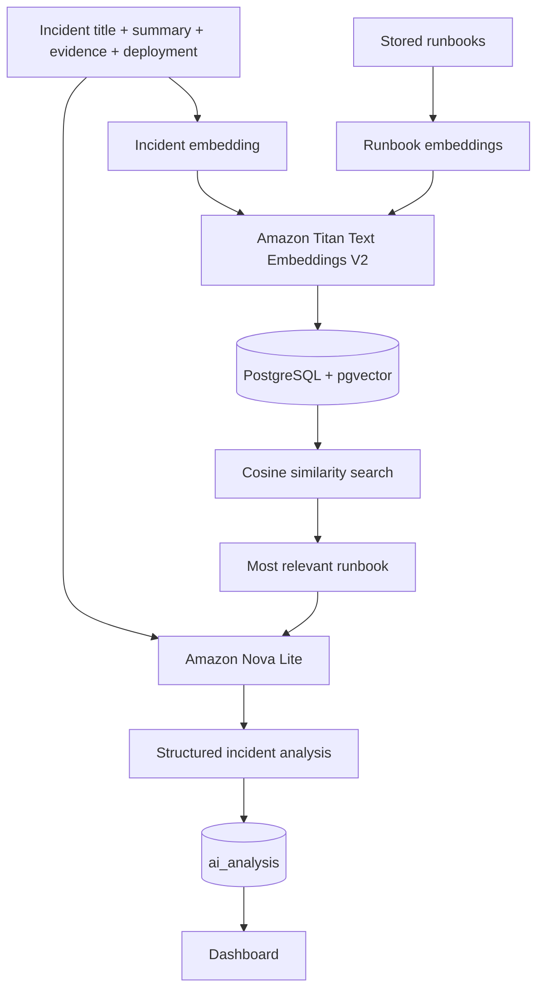

# OpsPilot AI

[](https://github.com/Nidhi8901/opspilot-ai/actions)
[](#technology-stack)
[](#technology-stack)
[](#cloud-deployment)
[](#ai--rag-flow)

**OpsPilot AI** is an AI-assisted cloud incident response and runbook platform built to help engineers triage operational incidents using structured evidence, semantic runbook retrieval, and grounded AI recommendations.

The project combines a production-style FastAPI application with PostgreSQL + pgvector, Amazon Bedrock, Docker, Kubernetes on Amazon EKS, Amazon RDS, Amazon ECR, GitHub Actions, Jenkins, SonarQube, Trivy, and Argo CD GitOps.

> The AI is advisory only. OpsPilot does not automatically change production infrastructure, restart workloads, or roll back deployments.

---

## Demo

### Operations dashboard



### AI-assisted incident investigation

| Incident analysis | Recommended runbook |
|---|---|
|  |  |

### DevSecOps and GitOps evidence

| Jenkins CI | Argo CD + EKS |
|---|---|
|  |  |

Additional screenshots are available in [`docs/assets`](docs/assets) and are explained in [`docs/demo-evidence.md`](docs/demo-evidence.md).

---

## Why I built it

During a production incident, engineers often have to correlate service health, recent deployments, error signals, database pressure, and troubleshooting runbooks before they can form an initial hypothesis.

OpsPilot AI brings those signals into one incident workflow:

1. display the incident and operational evidence
2. convert incident/runbook text into embeddings
3. retrieve the most relevant runbook with pgvector cosine similarity
4. send the incident context + retrieved runbook to Amazon Bedrock
5. return a structured analysis with probable cause, impact, recommended actions, rollback consideration, confidence, token usage, and latency
6. keep the engineer in control of the final action

---

## Key capabilities

- Incident command-center dashboard
- Service and deployment context
- Incident creation and incident detail workflow
- Amazon Bedrock incident analysis using Amazon Nova Lite
- Semantic runbook retrieval using Amazon Titan Text Embeddings V2
- PostgreSQL + pgvector vector search
- Stored AI analysis history
- Semantic match score exposed in the UI
- Dockerized FastAPI application
- Amazon EKS deployment
- Amazon RDS for PostgreSQL
- Amazon ECR image repository
- IAM Pod Identity for Bedrock access from EKS
- Kubernetes readiness/liveness probes and resource controls
- Separate GitOps repository managed by Argo CD
- GitHub Actions CI validation
- Jenkins CI with isolated test database
- SonarQube static analysis
- Trivy container vulnerability scanning
- EKS/RDS logging evidence through CloudWatch log groups
- Cost-conscious demo access through `kubectl port-forward`

---

## Architecture



The portfolio deployment intentionally used a `ClusterIP` service plus local port-forwarding instead of adding a public load balancer. This kept the demo architecture functional while avoiding another continuously billed resource.

See [`docs/architecture.md`](docs/architecture.md) for the detailed request, AI, deployment, and GitOps flows.

---

## AI / RAG flow



The model prompt explicitly instructs the AI to use only the supplied incident/runbook context, distinguish a probable cause from a confirmed cause, and avoid implying that it performed production changes.

---

## CI, security scanning, and GitOps

### GitHub Actions

The repository runs CI on pushes and pull requests to `main`.

The workflow:

- starts PostgreSQL + pgvector
- prepares the test schema
- starts FastAPI
- runs smoke tests
- validates the Docker image build

### Jenkins

The Jenkins pipeline was validated successfully with these stages:

```text
Checkout SCM
Checkout
Python Tests
SonarQube Analysis
Docker Build
Trivy Scan
Post Actions
```

The test stage creates an isolated pgvector PostgreSQL container, prepares the schema, starts FastAPI, waits for `/health`, runs pytest, and removes temporary test resources afterward.

SonarQube performs code-quality analysis. Trivy reports `HIGH` and `CRITICAL` image vulnerabilities. In this portfolio pipeline the Trivy stage is **reporting**, not a blocking security gate (`--exit-code 0`).

### GitOps

The separate repository [`opspilot-gitops`](https://github.com/Nidhi8901/opspilot-gitops) stores the Kubernetes desired state.

Argo CD Core was installed in the EKS cluster and validated with:

```text
opspilot-ai   Synced   Healthy
```

The database connection secret was provisioned separately and was not committed to Git.

See [`docs/cicd.md`](docs/cicd.md).

---

## Cloud deployment

The validated AWS deployment used:

- Amazon EKS
- one managed `t3.small` worker node for the final demo
- Amazon RDS PostgreSQL (`db.t3.micro`)
- pgvector extension
- Amazon ECR
- Amazon Bedrock
- Amazon Nova Lite
- Amazon Titan Text Embeddings V2
- EKS Pod Identity
- private database access
- CloudWatch log groups for EKS control-plane and RDS PostgreSQL logs
- Kubernetes `ClusterIP` service
- `kubectl port-forward` for demo access

The live cloud environment was intentionally torn down after successful validation and evidence capture to avoid ongoing EKS, NAT Gateway, database, and related infrastructure charges.

The GitHub repositories, Kubernetes manifests, screenshots, and screen recordings preserve the implementation evidence and make the design reproducible.

---

## Security decisions

- No AWS access keys are stored in source code.
- EKS used Pod Identity rather than static credentials.
- The database URL was stored in a Kubernetes Secret and excluded from Git.
- RDS was deployed privately and limited to the EKS security path.
- ECR image tag immutability was enabled during the deployment.
- `.env`, keys, local AWS configuration, and state files are ignored.
- The AI is advisory and cannot directly mutate infrastructure.
- Trivy scans the built image for high/critical vulnerabilities.
- SonarQube analyzes application code quality.
- The public-load-balancer layer was deliberately omitted for the portfolio demo.
- The cloud environment was deleted after validation to control cost.

See [`docs/security.md`](docs/security.md).

---

## Technology stack

| Area | Technology |
|---|---|
| Backend | Python 3.13, FastAPI |
| Frontend | HTML, CSS, JavaScript |
| Database | PostgreSQL, SQLAlchemy, Alembic |
| Vector search | pgvector |
| AI generation | Amazon Bedrock, Amazon Nova Lite |
| Embeddings | Amazon Titan Text Embeddings V2 |
| Containers | Docker, Docker Compose |
| Cloud | AWS, Amazon EKS, Amazon RDS, Amazon ECR |
| Kubernetes | Deployments, Services, probes, resource requests/limits |
| AWS workload auth | EKS Pod Identity + IAM |
| CI | GitHub Actions, Jenkins |
| Code quality | SonarQube |
| Container security | Trivy |
| GitOps | Argo CD Core |
| Testing | pytest, httpx |
| Observability evidence | CloudWatch log groups, health endpoint, Kubernetes status |

---

## API endpoints

| Method | Endpoint | Purpose |
|---|---|---|
| `GET` | `/health` | API/database health |
| `GET` | `/services` | List monitored services |
| `GET` | `/incidents` | List incidents |
| `POST` | `/incidents` | Create an incident |
| `GET` | `/incidents/{id}` | Incident details |
| `GET` | `/runbooks` | List runbooks |
| `GET` | `/incidents/{id}/recommended-runbook` | Semantic runbook retrieval |
| `POST` | `/incidents/{id}/analyze` | Grounded Bedrock analysis |
| `GET` | `/incidents/{id}/analysis/latest` | Latest stored analysis |
| `GET` | `/deployments` | Deployment records |
| `GET` | `/dashboard` | Operations dashboard |

---

## Run locally

### Requirements

- Python 3.13+
- Docker Desktop
- AWS CLI
- an authenticated AWS profile if testing live Bedrock calls
- Bedrock model access in the selected region

### Start the local stack

```bash
docker compose -f docker-compose.full.yml up -d --build
```

Open:

```text
http://127.0.0.1:8000/dashboard
```

Health check:

```text
http://127.0.0.1:8000/health
```

FastAPI docs:

```text
http://127.0.0.1:8000/docs
```

### Tests

```bash
pytest -q
```

The CI smoke tests intentionally avoid requiring a paid Bedrock generation call.

---

## GitOps repository

Kubernetes desired state is stored separately:

**Repository:** [`Nidhi8901/opspilot-gitops`](https://github.com/Nidhi8901/opspilot-gitops)

The GitOps repository contains:

```text
apps/
└── opspilot/
    ├── deployment.yaml
    └── kustomization.yaml
```

Argo CD owns synchronization between Git and the EKS workload. Application secrets are intentionally excluded.

---

## Engineering problems solved during the build

This project included several real troubleshooting situations rather than only a happy-path deployment:

- AWS CLI environment credentials overriding a valid profile
- EKS instance-size and pod-capacity constraints
- RDS database/pgvector initialization
- migration baseline limitations on a fresh RDS database
- Argo CD application project configuration
- Kubernetes container merge causing a duplicate port binding
- Jenkins smoke tests running before the API existed
- Jenkins Python module path mismatch
- safe teardown of EKS, RDS, NAT Gateway, ECR, IAM, CloudWatch, and the custom VPC while preserving the AWS default VPC

See [`docs/troubleshooting.md`](docs/troubleshooting.md) for the technical details and fixes.

---

## Current project status

**Application:** complete and demonstrated  
**AI + semantic retrieval:** complete and demonstrated  
**AWS deployment:** completed and validated  
**CI / security scanning:** completed and validated  
**GitOps:** completed and validated  
**Cloud demo resources:** intentionally torn down after evidence capture  
**GitHub source + deployment manifests:** retained

---

## Project boundaries

This is a portfolio-scale implementation designed to demonstrate DevOps, cloud, AI-assisted incident response, and GitOps concepts.

Important boundaries:

- AI confidence is model-generated and should not be treated as a calibrated probability.
- The AI does not autonomously remediate production systems.
- The final Jenkins pipeline validates/test/scans/builds; the ECR deployment image was pushed during the deployment workflow rather than by the final Jenkins pipeline.
- Kubernetes Secrets are not a replacement for a dedicated enterprise secrets-management platform.
- The current migration history contains a baseline limitation documented in the troubleshooting notes.

---

## Documentation

- [Architecture](docs/architecture.md)
- [CI/CD and GitOps](docs/cicd.md)
- [Security](docs/security.md)
- [Troubleshooting and lessons learned](docs/troubleshooting.md)
- [Demo evidence](docs/demo-evidence.md)

---

## Built by

**Nidhi Kumari**  
Cloud / DevOps

- GitHub: [Nidhi8901](https://github.com/Nidhi8901)
- LinkedIn: [nidhi-kumari-clouddevops](https://www.linkedin.com/in/nidhi-kumari-clouddevops)
