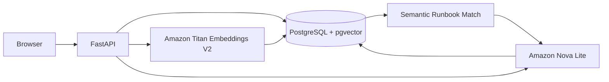
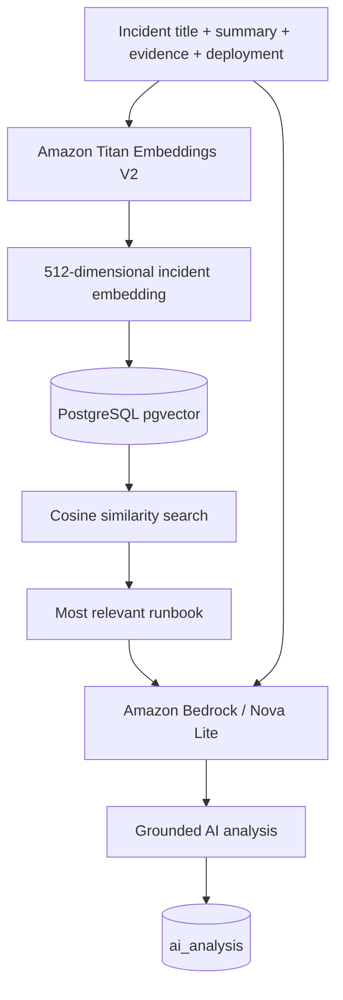
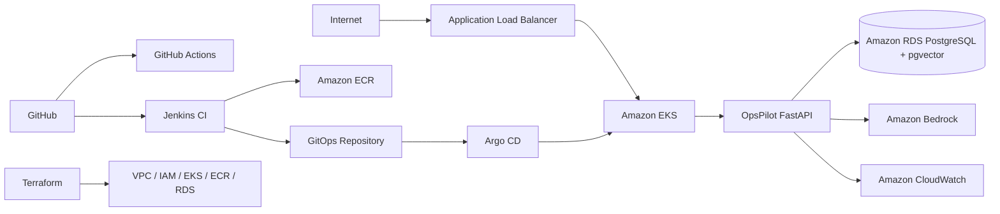

# OpsPilot AI

OpsPilot AI is an AI-assisted DevOps incident response and runbook platform built to help engineers triage incidents using operational evidence, semantic runbook retrieval, and grounded recommendations.

The project is intentionally designed as a DevOps/Cloud portfolio project rather than a generic CRUD application. It demonstrates incident workflows, containerization, PostgreSQL + pgvector, Amazon Bedrock, semantic RAG, database migrations, health checks, and automated tests. The cloud deployment layer will add Terraform, EKS, RDS, ECR, Argo CD, Jenkins, GitHub Actions, and CloudWatch.

## Why this project exists

During incidents, engineers often jump between logs, metrics, deployments, runbooks, and multiple tools before forming an initial hypothesis.

OpsPilot AI centralizes incident context and uses AI to help with:

- incident summarization
- probable-cause analysis
- impact interpretation
- ordered troubleshooting recommendations
- rollback considerations
- semantic retrieval of relevant runbooks

The AI is advisory only. It does not automatically make production changes.

## Current status

### Implemented

- FastAPI backend
- custom incident command-center frontend
- PostgreSQL persistence
- pgvector 0.8.x
- runbook storage
- Amazon Titan Text Embeddings V2
- semantic runbook retrieval using cosine similarity
- Amazon Nova Lite through Amazon Bedrock
- grounded AI incident analysis
- stored AI analysis history
- incident embedding cache
- semantic match score
- Alembic database migrations
- Dockerized FastAPI application
- Dockerized PostgreSQL + pgvector
- container health checks
- persistent Docker volume
- local Docker Bedrock authentication through a read-only AWS profile mount
- smoke tests with pytest + httpx

### Planned cloud / DevOps layer

- Terraform
- Amazon VPC
- Amazon ECR
- Amazon EKS
- Amazon RDS for PostgreSQL
- IAM / workload identity
- Kubernetes manifests
- HPA and resource controls
- GitHub Actions
- Jenkins
- Argo CD / GitOps
- CloudWatch logs, metrics, and alarms
- incident simulation and production-style observability

## Local architecture



## RAG flow



## Planned AWS architecture



> The AWS architecture above is the target deployment architecture. EKS, RDS, ECR, Argo CD, Jenkins, GitHub Actions, CloudWatch integration, and Terraform are not claimed as deployed until they are actually implemented.

## Core API endpoints

| Method | Endpoint | Purpose |
|---|---|---|
| GET | `/health` | API + database health |
| GET | `/services` | list monitored services |
| GET | `/incidents` | list incidents |
| POST | `/incidents` | create an incident |
| GET | `/incidents/{id}` | incident details |
| GET | `/runbooks` | list runbooks |
| GET | `/incidents/{id}/recommended-runbook` | semantic runbook retrieval |
| POST | `/incidents/{id}/analyze` | grounded Bedrock analysis |
| GET | `/incidents/{id}/analysis/latest` | latest stored AI analysis |
| GET | `/deployments` | deployment records |

## Local development

### Requirements

- Python 3.13+
- Docker Desktop
- AWS CLI
- authenticated AWS profile named `opspilot`
- Bedrock access in `ap-south-1`

### Start with Docker

```bash
docker compose -f docker-compose.full.yml up -d --build
```

Check:

```bash
docker compose -f docker-compose.full.yml ps
```

Open:

```text
http://127.0.0.1:8000/dashboard
```

API docs:

```text
http://127.0.0.1:8000/docs
```

## Tests

Install test dependencies:

```bash
pip install pytest httpx
```

Run:

```bash
pytest
```

The smoke test suite intentionally avoids triggering a paid Bedrock generation request.

## Database migrations

Alembic is used for schema changes.

```bash
python -m alembic current
python -m alembic upgrade head
```

For a new model change:

```bash
python -m alembic revision --autogenerate -m "describe migration"
python -m alembic upgrade head
```

## Security decisions

- `.env` is not committed
- AWS keys are not stored in source code
- local Docker uses a read-only mount of the local AWS profile
- production EKS will use AWS workload identity instead of a local profile
- AI recommendations do not execute infrastructure changes automatically
- PostgreSQL credentials currently used in Docker are local-development-only

## Technology stack

**Application:** Python, FastAPI, HTML, CSS, JavaScript  
**Data:** PostgreSQL, SQLAlchemy, Alembic, pgvector  
**AI:** Amazon Bedrock, Amazon Nova Lite, Amazon Titan Text Embeddings V2  
**Testing:** pytest, httpx  
**Containers:** Docker, Docker Compose  
**Planned DevOps:** Terraform, Kubernetes, EKS, ECR, RDS, Argo CD, Jenkins, GitHub Actions, CloudWatch

## Interview summary

> I built OpsPilot AI because I wanted a project directly related to DevOps work instead of another generic application. During incidents, engineers manually correlate service health, deployment history, logs, metrics, and runbooks. OpsPilot centralizes incident evidence, retrieves the most relevant runbook using semantic vector search, and sends that grounded context to Amazon Bedrock for an initial analysis and recommended troubleshooting steps. The AI remains advisory so production changes stay under human control.

## Roadmap

1. production-grade Docker hardening
2. unit and integration test expansion
3. Terraform AWS infrastructure
4. ECR + EKS deployment
5. RDS PostgreSQL migration
6. Kubernetes probes, resources, and autoscaling
7. GitHub Actions PR validation
8. Jenkins CI pipeline
9. Argo CD GitOps deployment
10. CloudWatch ingestion and incident correlation
11. security hardening and final demo
