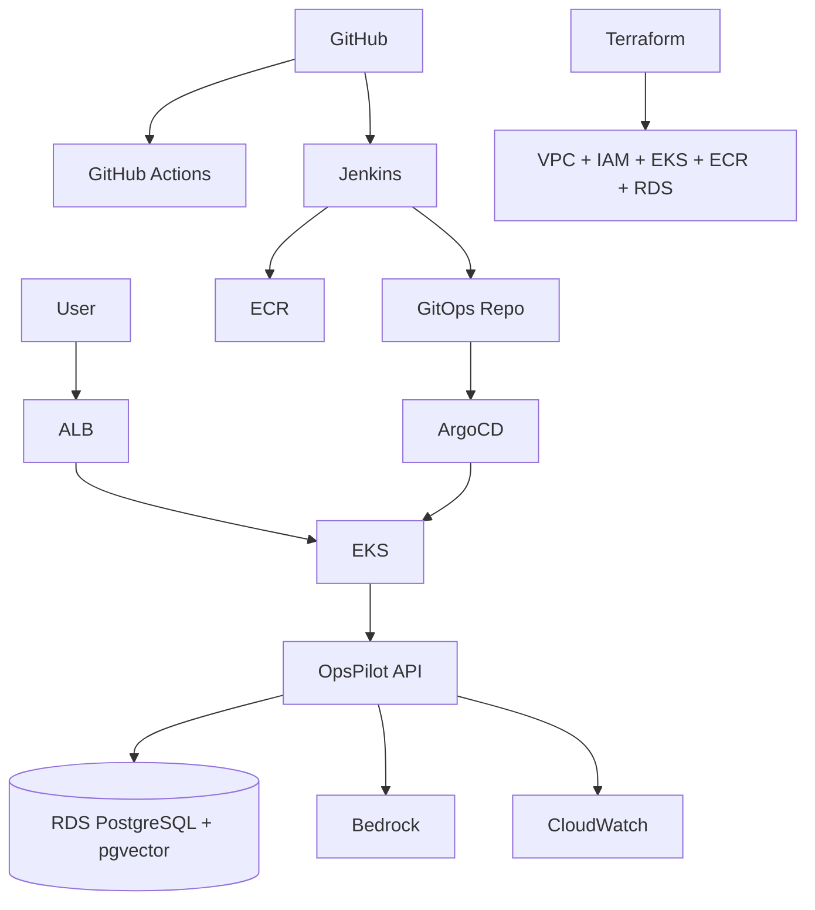

# OpsPilot AI Architecture

## 1. Application responsibility

OpsPilot AI is an incident-response assistant. It accepts or displays incident context, retrieves a relevant operational runbook, asks Amazon Bedrock for a grounded analysis, stores the result, and presents it to the engineer.

It does not automatically restart pods, roll back deployments, modify AWS resources, or apply infrastructure changes.

## 2. Local runtime

The current local stack consists of:

- Browser
- FastAPI application container
- PostgreSQL + pgvector container
- Amazon Titan Text Embeddings V2
- Amazon Nova Lite through Amazon Bedrock
- Docker persistent volume
- Alembic migrations

### Request path

1. A user opens an incident in the dashboard.
2. FastAPI reads incident and service data from PostgreSQL.
3. OpsPilot creates or reuses the incident embedding.
4. PostgreSQL pgvector performs cosine similarity search against embedded runbooks.
5. The highest relevant runbook is retrieved.
6. Incident context + runbook context are sent to Amazon Nova Lite.
7. The structured analysis is stored in `ai_analysis`.
8. The UI displays the analysis, grounding source, semantic score, token usage, and latency.

## 3. Data model

Core entities:

- `services`
- `incidents`
- `deployments`
- `runbooks`
- `ai_analysis`

Vector data:

- `runbooks.embedding` -> `vector(512)`
- `incidents.embedding` -> `vector(512)`

## 4. AI design

### Embedding model

Amazon Titan Text Embeddings V2 is used to create normalized 512-dimensional vectors.

### Retrieval

Similarity is calculated in PostgreSQL using pgvector cosine distance.

### Generation

Amazon Nova Lite receives:

- service context
- incident metadata
- incident summary
- evidence
- recent deployment information
- retrieved runbook context

The response is constrained to structured JSON.

## 5. Why RAG instead of a generic chatbot

A generic chatbot could produce troubleshooting advice without knowing the project's operational procedures.

RAG allows OpsPilot to ground recommendations in stored runbooks so an engineer can see which source influenced the analysis.

## 6. Planned production deployment

The target AWS design is:

## 7. CI/CD responsibility split

### GitHub Actions

Planned for lightweight pull-request validation:

- Python checks
- tests
- Terraform formatting / validation
- YAML validation

### Jenkins

Planned for main CI:

- test execution
- SonarQube analysis
- Docker build
- Trivy image scan
- ECR push
- GitOps repository update

### Argo CD

Argo CD will own deployment synchronization from Git to EKS.

Jenkins will not directly run `kubectl apply`.

## 8. AWS authentication

### Local development

The Docker API container reads the `opspilot` AWS profile through a read-only host mount.

### Production

The local profile mount will be removed. EKS workloads will use IAM workload identity / Pod Identity with least-privilege access to required AWS services.
