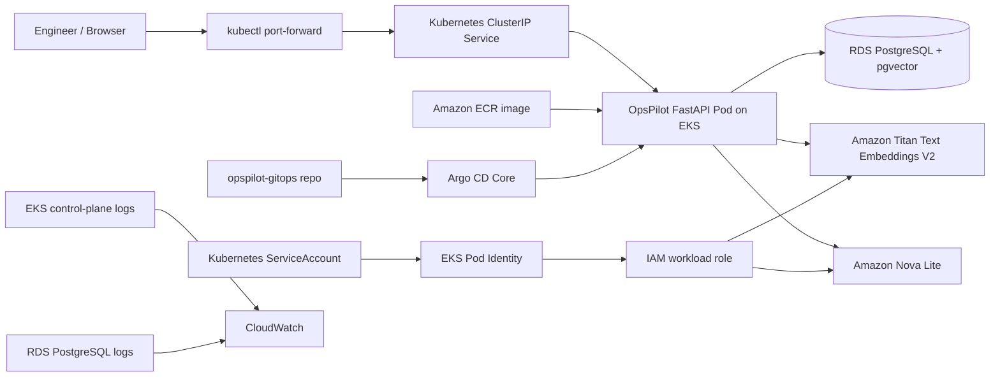
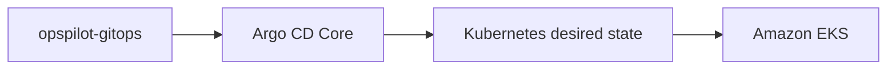

# OpsPilot AI — Architecture

## 1. System responsibility

OpsPilot AI is an AI-assisted incident-response platform. It collects incident context, retrieves the most relevant operational runbook using semantic vector search, asks Amazon Bedrock for a grounded analysis, stores the response, and presents the result to an engineer.

The system deliberately does **not** automatically restart pods, modify AWS infrastructure, or trigger rollbacks.

## 2. As-built cloud architecture



For the portfolio demo, external access was intentionally kept private. A public load balancer was not added; the application was accessed with `kubectl port-forward` through the Kubernetes `ClusterIP` service.

## 3. Request flow

1. The engineer opens the dashboard through the local port-forward.
2. FastAPI reads services, incidents, deployments, runbooks, and stored AI analyses from PostgreSQL.
3. When the engineer requests an incident analysis, OpsPilot obtains or reuses the incident embedding.
4. PostgreSQL + pgvector performs cosine similarity search against embedded runbooks.
5. The most relevant runbook is retrieved with a semantic match score.
6. The incident evidence and selected runbook are supplied to Amazon Nova Lite.
7. The Bedrock response is validated as structured JSON.
8. The analysis is persisted in `ai_analysis`.
9. The UI displays summary, probable cause, impact, recommended actions, rollback consideration, confidence, runbook source, token usage, and latency.

## 4. AI / semantic retrieval

### Embeddings

Amazon Titan Text Embeddings V2 is used with 512-dimensional vectors.

Vector data is stored in PostgreSQL through pgvector.

### Retrieval

OpsPilot performs semantic similarity retrieval so runbooks can match an incident by meaning rather than only exact keyword overlap.

### Generation

Amazon Nova Lite receives:

- service context
- environment and service status
- incident ID/title/severity/status
- incident summary
- evidence
- recent deployment information
- retrieved runbook context

The system prompt instructs the model to:

- use only supplied evidence
- avoid inventing logs/metrics/deployments
- distinguish probable from confirmed causes
- treat runbooks as guidance rather than proof
- return structured JSON
- avoid implying production changes were executed

## 5. Data model

Core tables:

- `services`
- `incidents`
- `deployments`
- `runbooks`
- `ai_analysis`
- `alembic_version`

Vector fields use `vector(512)` for semantic retrieval.

## 6. Kubernetes design

The final deployment used:

- namespace: `opspilot`
- deployment: `opspilot-api`
- service: `opspilot-api`
- service type: `ClusterIP`
- service account: `opspilot-api`
- readiness probe: `/health`
- liveness probe: `/health`
- CPU request: `100m`
- memory request: `128Mi`
- CPU limit: `500m`
- memory limit: `512Mi`

The database URL was provided through the `opspilot-secrets` Kubernetes Secret and not stored in Git.

## 7. AWS authentication

The EKS workload used Pod Identity.

```text
Kubernetes service account
        ↓
EKS Pod Identity association
        ↓
IAM workload role
        ↓
Amazon Bedrock runtime
```

No static AWS access keys were placed in the application container or Kubernetes manifests.

## 8. GitOps architecture



Argo CD Core was selected because the portfolio cluster used one small worker node with limited pod capacity.

The validated application state reached:

```text
SYNC     HEALTH
Synced   Healthy
```

## 9. Demo lifecycle

The AWS environment was live long enough to validate:

- EKS workload health
- RDS connectivity
- pgvector
- Bedrock invocation through Pod Identity
- ECR image deployment
- Argo CD synchronization
- Kubernetes probes
- CloudWatch log groups
- application UI and API

After screenshots and screen recordings were captured, the cloud resources were intentionally deleted to avoid ongoing infrastructure charges.
